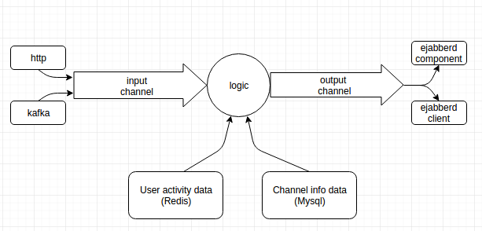

Announcer
=========
Announcer is an interface for send xml message to online users.

In order to communicate with ejabberd servers it can use client or component connections([XEP-0114](http://xmpp.org/extensions/xep-0114.html)) based on configuration.



Configuration
-------------
```toml
rest_api_port=":8080" #Rest api interface and port listen on
debug_port=":6060"
input_buffer=100 #Input channel buffer
output_buffer=100 #Output channel buffer

[log]
log_level="debug" #debug/info/warning/error (default: warning)
format="text" #json/text/logrous (defualt: logrous)

[kafka]
zookeeper="127.0.0.1:2181/"
topics="test-topic" #Multi topic can seperate with ','
group_name="announcer"
buffer=1000
commit_offset_interval=10 #Notify zookeeper offset every commit_offset_interval message

[mysql]
address="127.0.0.1:3306"
username="test"
password="123"
db="testDB"
pagination_length=100 #Fetch channel data bulk size

[redis]
cluster_nodes="127.0.0.1:6379"
password=""
db=0
set_prefix="192.168."
offline_hash_table="Offline"
check_interval=100

[ejabberd]
cluster_nodes="127.0.0.1:8889"
rate_limit=10 #Msg/sec
send_retry=6

#[client]
#username="admin"
#password="password1234"
#domain="example.de"
#ping_interval=2 #Second
#resource="announcer"

[component]
name="announcer"
secret="announcer"
domain="soroush.ir"
ping_interval=110
```

>To use component connection you must be define component port for ejabberd servers

Rest APIs
---------
|URI|type|Description|
|---|----|-----------|
|/v1/announce/channel|POST|send channel message to that channel online members|
|/v1/announce/user|POST|send a message to user|

Samples
-------

**announce channel message:**

**POST** request to **/v1/announce/channel** with json data like

```json
{
  "channel": 22,
  "message": "BASE64_ENCODED_MESSAGE"
}
```
we have some issue with messages that they contain new line characters so for fast solutions we base64 message
> **Attention:** You should put ["%s"](https://golang.org/pkg/fmt/) instead of username who this message will be send for

sample message before base64 encoding
```xml
<message xml:lang='en' to='%s' type='chat' id='ID_NUMBER' xmlns='jabber:client'><body>MESSAGE_CONTENT</body><body xml:lang='REPLY_ON_THREAD_ID'>989198872580</body><body xml:lang='MAJOR_TYPE'>SIMPLE_CHAT</body><body xml:lang='MINOR_TYPE'>TEXT</body><body xml:lang='REPLY_ON_MESSAGE_ID'>15219732781131af24fc1zwf</body><body xml:lang='SEND_TIME_IN_GMT'>1521973339583</body></message>
```

In order to send a message to **all online users** you need to set channel_id **negative number**.

**Announce user message:**
**POST** request **/v1/announce/user** with json data like
```json
{
    "username": "USERNAME",
    "message": "ENCODE_MESSAGE_TO_BASE64"
}
```
Message will be send to specific user without any check that is he online or not

sample message before base64 encoding:
```xml
<message xml:lang='en' to='%s' type='chat' id='ID_NUMBER' xmlns='jabber:client'><body>MESSAGE_CONTENT</body><body xml:lang='REPLY_ON_THREAD_ID'>989198872580</body><body xml:lang='MAJOR_TYPE'>SIMPLE_CHAT</body><body xml:lang='MINOR_TYPE'>TEXT</body><body xml:lang='REPLY_ON_MESSAGE_ID'>15219732781131af24fc1zwf</body><body xml:lang='SEND_TIME_IN_GMT'>1521973339583</body></message>
```

Kafka APIs
----------
message structures are like rest api
connection handling
-------------------
**Redis**
Connection to redis server will be check every "check_interval" second.
If we lost our connection we will discard fetch data from that till connection establish again

**Ejabberd Component**
Based on component "ping_interval" configuration; send ping to end server every "ping_interval" second

**Ejabberd Client**
Based on component "ping_interval" configuration; send ping to end server every "ping_interval" second

**Ejabberd connections**
On send time we check that if they are available or not
if lost a connection we will remove that form available connection and when connection numbers goes to 0
we try to connect to all ejabberd nodes again

Debugging
---------
Call `http://<SERVER_IP>:<debug_port>/debug/pprof/trace?seconds=5` to get 5 second of application trace file and then you can see application trace. With
`go tool trace <DOWNLOADED_FILE_PATH>` command you can see what's happen in application on that period of time