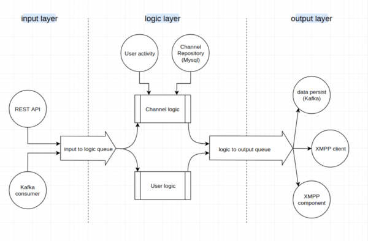

Announcer
=========
Announcer is an interface for send xml message to online users.

In order to communicate with ejabberd servers it can use client or component connections([XEP-0114](http://xmpp.org/extensions/xep-0114.html)) based on configuration.



Configuration
-------------
```toml
rest_api_port=":8080" #Rest api interface and port listen on
debug_port=":6060"
input_buffer=100      #Input channel buffer
output_buffer=100     #Output channel buffer
logic_process_number=2      #Increase logic concurrency
user_activity_ask_buffer=1000

[monitoring]
buffer_report_duration=1    #Report buffer fill length every X sec

[log]
log_level="debug"     #debug/info/warning/error (default: warning)
format="text"         #json/text (defualt: text)
log_dst="/path/to/dest/file.log" #Optional

[kafka-consumer]
zookeeper="127.0.0.1:2181/"
topics="test-topic"       #Multi topic can seperate with ','
group_name="announcer"
buffer=1000

[mysql]
address="127.0.0.1:3306"
username="test"
password="123"
db="testDB"
pagination_length=100    #Fetch channel data bulk size
max_ideal_conn=50       #Optional (default: 10)
max_open_conn=50        #Optional (default: 10)

#announcer must be connect to one the rest-api or redis interface
[user-activity-redis]
cluster_nodes="127.0.0.1:6379"
password=""
db=0
read_timeout=1000       #optional sec (default: 1000 milisecond)
max_retries=2           #optional (default: 0)

[user-activity-rest-api]
address="127.0.0.1:8888"
request_timeout=12      #optional milisecond (default: 500 milisecond)
idle_conn_timeout=1     #optional sec (default: 90 sec)
max_idle_conn=1         #optional (default: 100)
max_retry=1             #optional (default: 3)

[kafka-producer]
brokers="192.168.2.1:9092,192.168.2.2:9092,192.168.2.3:9092" #optional (default: 127.0.0.1:9092)
topics="test-topic-name"
flush_frequency=3      #optional sec (default: 5 sec)
MaxRetry=3             #optional (default: 5)

[ejabberd]
cluster_nodes="127.0.0.1:8889"
rate_limit=10           #Msg/sec
send_retry=6
each_node_conn_num=1

#[client]
#username="admin"
#password="password1234"
#domain="example.de"
#ping_interval=2 #Second
#resource="announcer"

[component]
name="announcer"
secret="announcer"
domain="soroush.ir"
ping_interval=110
max_conn_check_retry=10000
conn_req_check_interval=10
```

>To use component connection you must be define component port for ejabberd servers


Installation
------------
Define it as a systemd service in `/etc/systemd/system/announcer.service` file
```service
[Unit]
Description=Announcer
After=network.target
Wants=network.target

[Service]
WorkingDirectory=/root/announcer
ExecStart=/root/announcer/announcer
Restart=on-failure

[Install]
WantedBy=multi-user.target
```

And then add `check_up.sh` as a cron job to check service recovery if ejabberd service goes down for a long time
```bash
*/5 * * * *	root /root/announcer/check_up.sh  > /var/log/announcer_cron_check.log
```
And use `get_conn_len.sh` script in order to monitor service connection with zabbix
```
UserParameter=conn.len[*],cat /etc/zabbix/connections | grep $1 | awk '{print $$2}'
```

Rest APIs
---------
|URI|type|Description|
|---|----|-----------|
|/v1/announce/channel|POST|send channel message to that channel online members|
|/v1/announce/users|POST|send a message to users|

Samples
-------

**announce channel message:**

**POST** request to **/v1/announce/channel** with json data like

```json
{
  "channel_id": 22,
  "message": "BASE64_ENCODED_MESSAGE"
}
```
we have some issue with messages that they contain new line characters so for fast solutions we base64 message
> **Attention:** You should put ["%s"](https://golang.org/pkg/fmt/) instead of username who this message will be send for

sample message before base64 encoding
```xml
<message xml:lang='en' to='%s' from="USERNAME@s/announcer" type='chat' id='ID_NUMBER' xmlns='jabber:client'><body>MESSAGE_CONTENT</body><body xml:lang='REPLY_ON_THREAD_ID'>989198872580</body><body xml:lang='MAJOR_TYPE'>SIMPLE_CHAT</body><body xml:lang='MINOR_TYPE'>TEXT</body><body xml:lang='REPLY_ON_MESSAGE_ID'>15219732781131af24fc1zwf</body><body xml:lang='SEND_TIME_IN_GMT'>1521973339583</body></message>
```

In order to send a message to **all online users** you need to set channel_id **negative number**.

**Announce users message:**
**POST** request **/v1/announce/users** with json data like
```json
{
    "usernames": ["USERNAME_1", ..., "USERNAME_N"],
    "message": "BASE64_ENCODE_MESSAGE",
    "persist": true
}
```
Message will be send to specific user without any check that is he online or not

sample message before base64 encoding:
```xml
<message xml:lang='en' to='%s' from="USERNAME@s/announcer" type='chat' id='ID_NUMBER' xmlns='jabber:client'><body>MESSAGE_CONTENT</body><body xml:lang='REPLY_ON_THREAD_ID'>989198872580</body><body xml:lang='MAJOR_TYPE'>SIMPLE_CHAT</body><body xml:lang='MINOR_TYPE'>TEXT</body><body xml:lang='REPLY_ON_MESSAGE_ID'>15219732781131af24fc1zwf</body><body xml:lang='SEND_TIME_IN_GMT'>1521973339583</body></message>
```
if message persistable it will be store in kafka and then in DBs if not it will be not.(default value is true)

Kafka APIs
----------
message structures are like rest api

connection handling
-------------------
**User activity Rest API**
Http connections are reusable, if they are busy new connection will be create

**User activity Redis**
Connection will be check every "check_interval" second.
If connection lost it will discard fetch data from that till connection establish again

**Mysql**
Connection will be check every "check_interval" second.
If connection lost it try to connect to again on "check_interval".

**Ejabberd Client** and **Ejabberd Component**
Based on "ping_interval" configuration; send ping to keep connection alive every "ping_interval" second.
If the connection lost system try to reconnect to

Redis Data Model
----------------
Online users:
```
<USERNAME> <ONLINE.SERVER.IP.ADDRESS>
```
Each server online users is store in set type data. we use these data to fetch all online users
```
<ONLINE.SERVER.IP.ADDRESS> [<USERNAME1> ... <USERNAME_N>]
```
Offline users:
```
<OFFLINE_HASHTABLE> <USERNAME> <TIME_STAMP_MILISECOND>
```

Debugging
---------
Debugging rest APIs

- http://`<SERVER_IP>:<debug_port>`/debug/pprof/goroutine
- http://`<SERVER_IP>:<debug_port>`/debug/pprof/heap
- http://`<SERVER_IP>:<debug_port>`/debug/pprof/threadcreate
- http://`<SERVER_IP>:<debug_port>`/debug/pprof/block
- http://`<SERVER_IP>:<debug_port>`/debug/pprof/mutex
- http://`<SERVER_IP>:<debug_port>`/debug/pprof/profile
- http://`<SERVER_IP>:<debug_port>`/debug/pprof/trace?seconds=5

Call `http://<SERVER_IP>:<debug_port>/debug/pprof/trace?seconds=5` to get 5 second of application trace file and then you can see application trace. With
`go tool trace <DOWNLOADED_FILE_PATH>` command you can see what's happen in application on that period of time

Call `http://<SERVER_IP>:<debug_port>/debug/pprof/profile` to get service profile and then run `go tool pprof <DOWNLOADED_FILE_PATH>` command go see more details about appli   cation processes

To get more information you can see [How to use pprof](https://www.integralist.co.uk/posts/profiling-go/) article